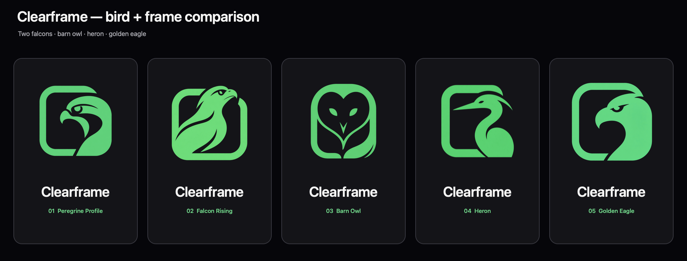

# Clearframe bird + frame comparison

**Date:** August 31, 2026  
**Status:** Concept exploration; not production vector artwork or trademark clearance

This board compares five bird species and poses using one structural rule: the
bird flows directly into a substantial rounded-square frame. Every concept is
paired with the same exact `Clearframe` wordmark so the animal is the variable,
not the presentation.

## Concepts

1. Peregrine Profile — compact, level side profile for speed and clear sight.
2. Falcon Rising — upward-looking profile for lift and possibility.
3. Barn Owl — front-facing heart-shaped facial disk for calm intelligence.
4. Heron — long beak and S-shaped neck for observation and composure.
5. Golden Eagle — broad skull and heavy beak for confidence and authority.

## Shared generation brief

- Use the earlier wolf concepts only as structural references: animal and
  frame form one silhouette.
- Calm intelligence and clear sight without aggression or sports-mascot cues.
- Compact, flat, mint `#66DB7D`, vector-friendly geometry.
- No spread wings, heraldry, shields, globes, compasses, crowns, landscapes,
  moons, flames, feather detail, or stock-logo presentation.
- No generated text; `make-board.swift` adds the exact shared wordmark.

Four generated concepts initially baked a checkerboard into their backgrounds.
The built-in image-generation workflow produced non-destructive transparent
cleanup variants before board assembly. The selected direction should still
be redrawn as deterministic vector paths, optically corrected at shipped icon
sizes, and checked against existing trademarks and common logo constructions.
