# Clearframe logo exploration

> These sheets were made on August 31, 2026, while the product was still
> called **Clearframe**. It was renamed **Limeghost** the same day —
> [why](../naming-decision-2026-08-31.md). The wordmarks below are therefore
> the old name; the symbols are what mattered here.

**Date:** August 31, 2026  
**Status:** Concept exploration, not production artwork or trademark clearance

These ten raster concepts explore how Clearframe's existing mint-on-near-black
identity could become more distinctive without changing the product's calm,
ordinary-user positioning. They are comparison renders, not source vectors.
The selected direction should be redrawn deterministically in the existing
Swift icon generator, optically corrected at every shipped size, and checked
for visual and trademark collisions before adoption.

## Small-scale comparison

The sheet below reduces each render to 32 pixels and enlarges it with nearest-
neighbour sampling. The top row is concepts 1–5; the bottom row is 6–10.

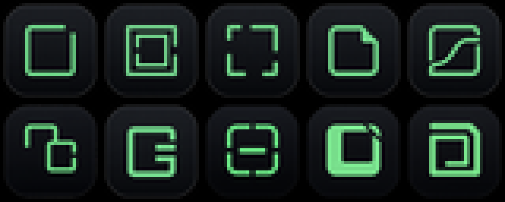

## Concepts

| # | Direction | Concept | Preview |
|---|-----------|---------|---------|
| 1 | Open Corner | One continuous frame with a deliberate asymmetric opening. | 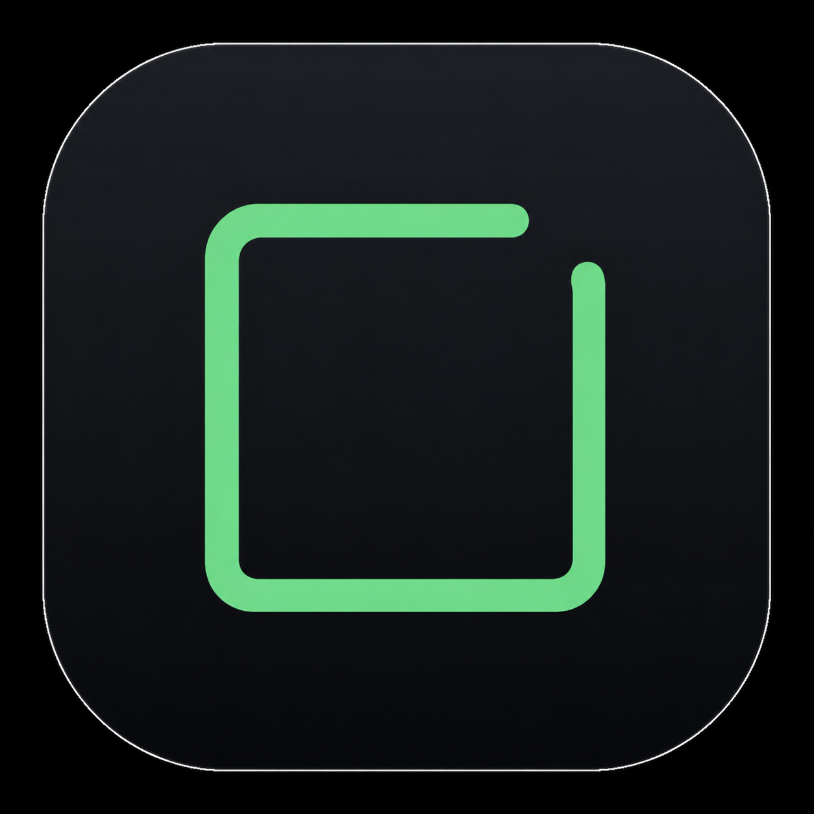 |
| 2 | Nested Portal | Opposing openings in two concentric frames create a path through the center. | 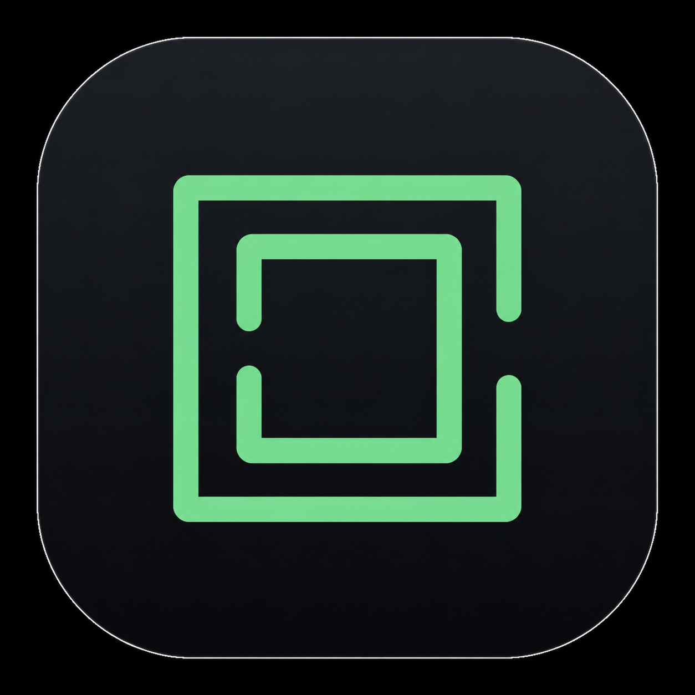 |
| 3 | Four Corners | Four unequal brackets move the eye clockwise around a clear center. | 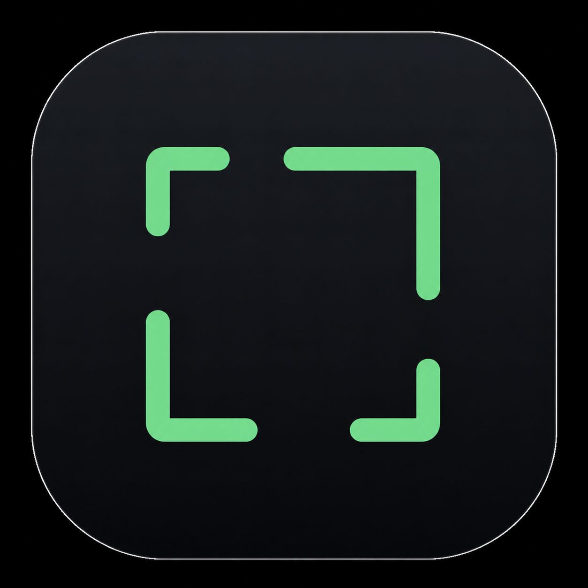 |
| 4 | Forward Fold | One corner opens outward to suggest revealing a clearer view. | 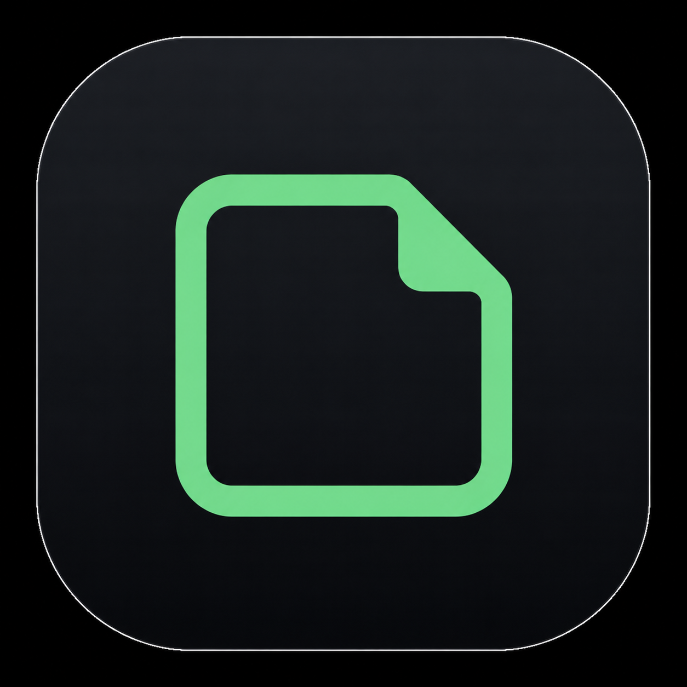 |
| 5 | Clear Path | A continuous route crosses the frame from lower-left to upper-right. | 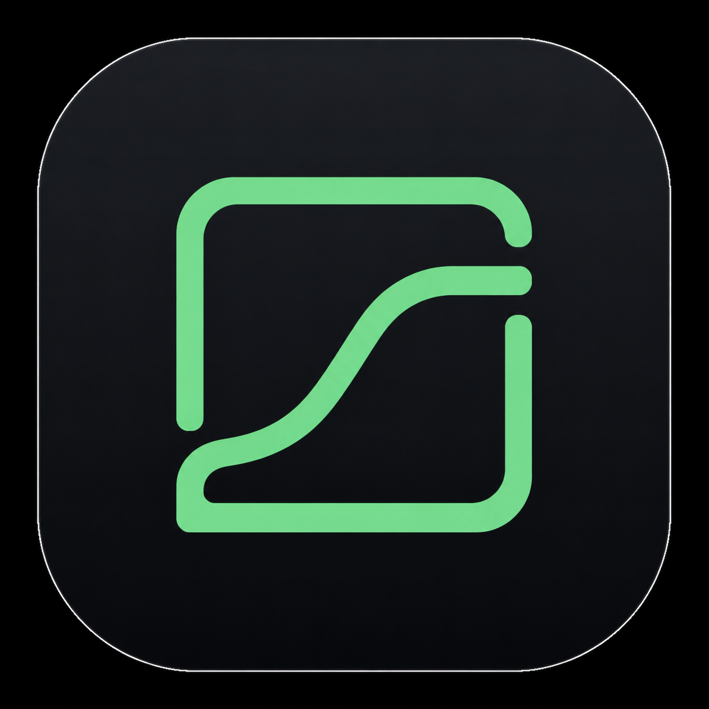 |
| 6 | Pane Shift | Two offset incomplete frames suggest moving from one view to another. | 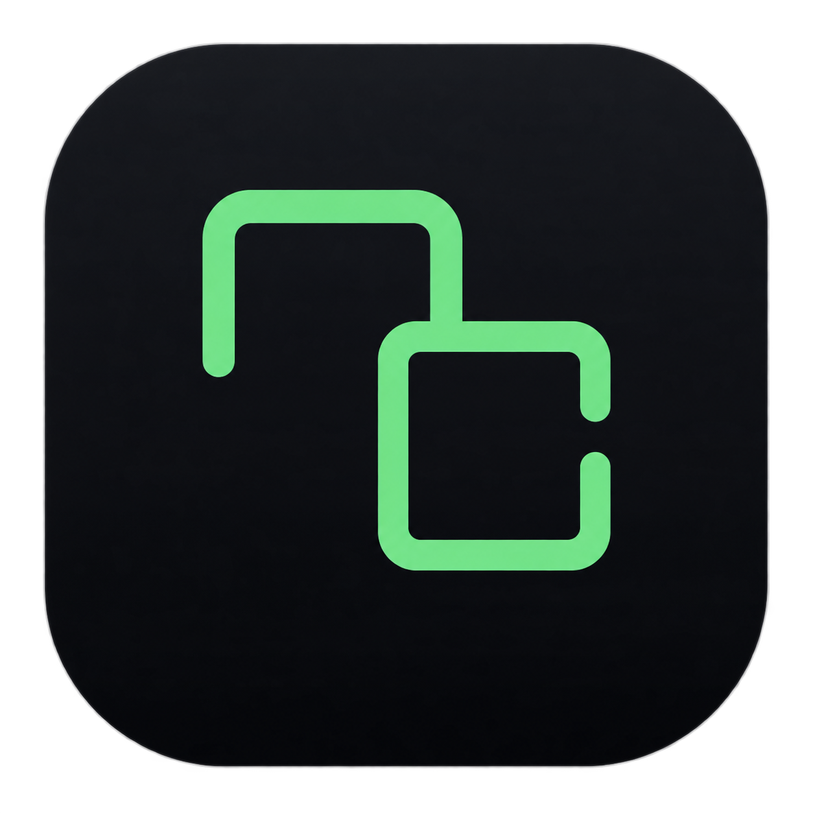 |
| 7 | CF Monogram | A geometric initials experiment contained within a square proportion. | 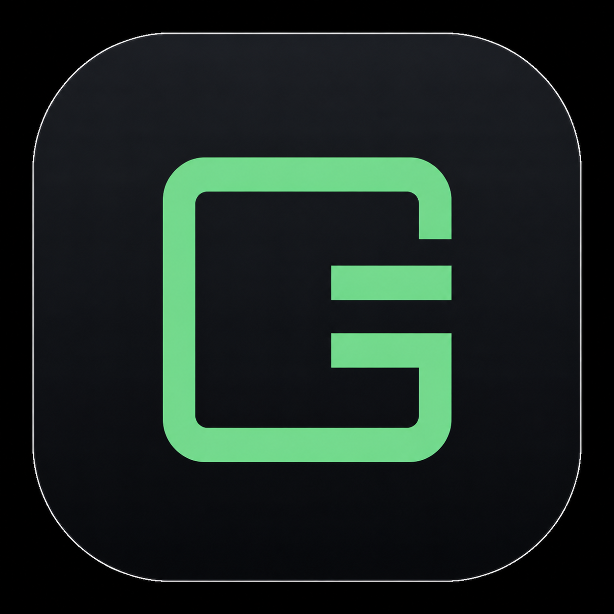 |
| 8 | Clear Horizon | A centered horizontal line aligns four interrupted sides. | 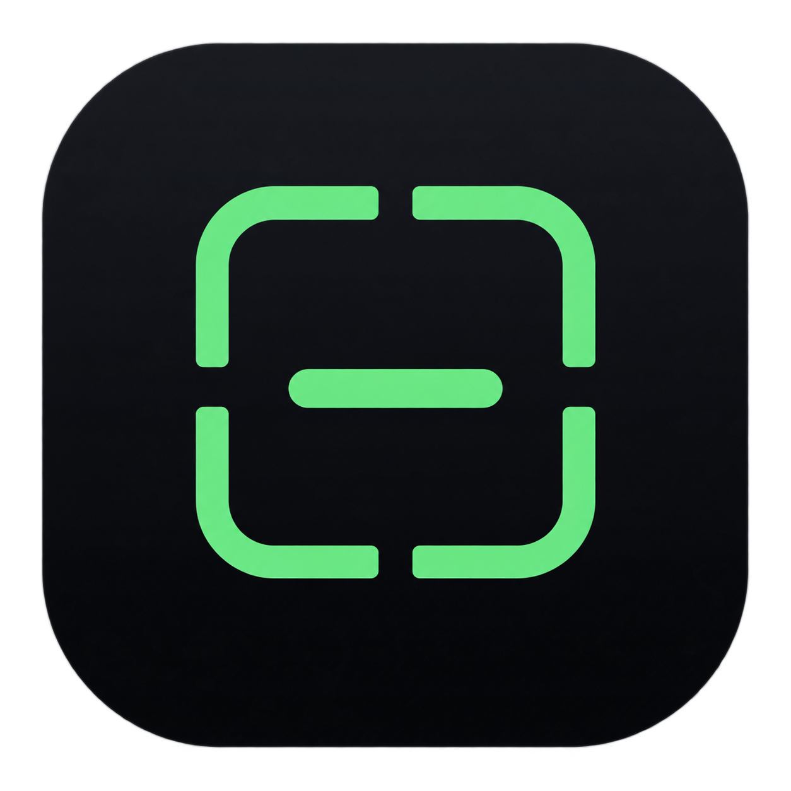 |
| 9 | Cutaway Frame | A heavy positive shape uses an off-center clear window and diagonal opening. | 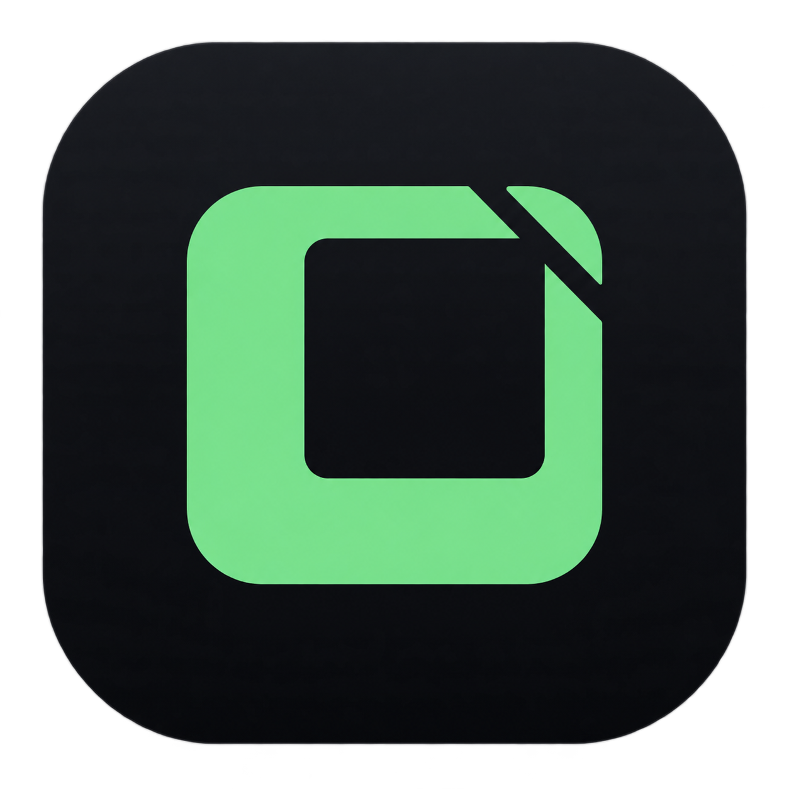 |
| 10 | One Ribbon | A single ribbon resolves from an outer frame into an inner clear frame. | 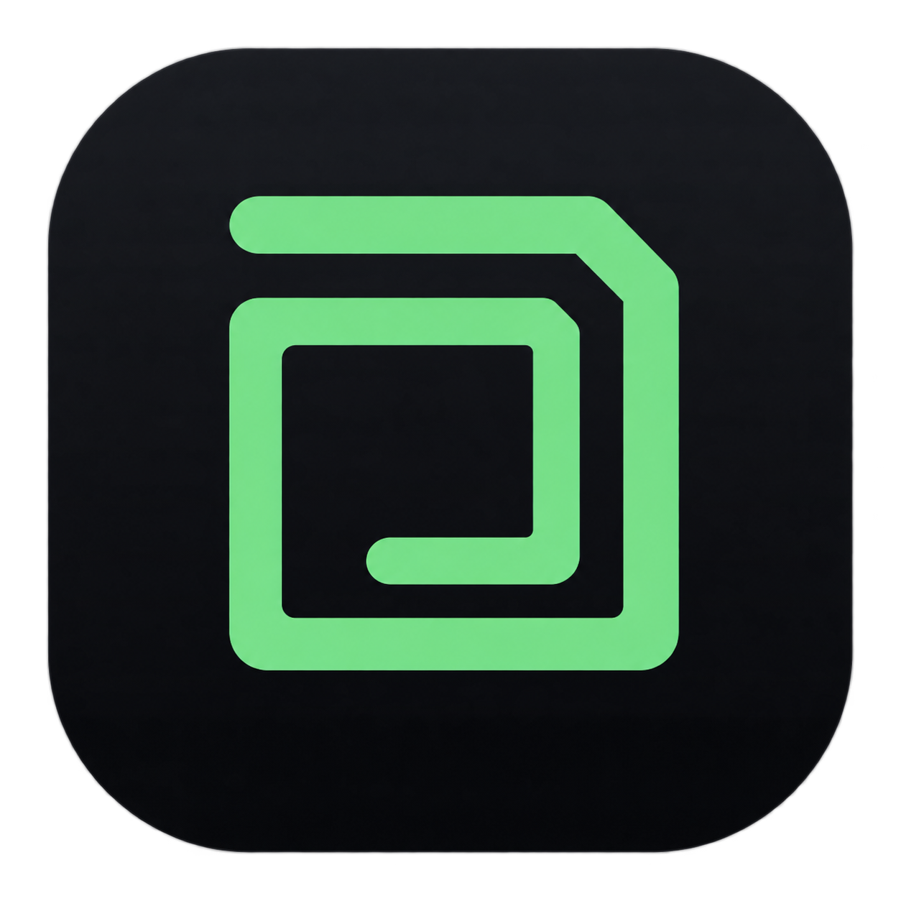 |

## Brand assessment

The strongest starting points are **Open Corner**, **Nested Portal**, and **One
Ribbon**. Open Corner is the clearest and most durable at small sizes. Nested
Portal has more narrative value but needs fewer competing gaps. One Ribbon is
the most proprietary-looking direction, although its inner turn needs optical
simplification so it does not read as a letter G.

The other concepts are useful eliminations:

- Four Corners resembles scanner and focus-reticle symbols.
- Forward Fold resembles a document or file.
- Clear Path can read as an S or chart.
- Pane Shift resembles duplicate windows or a chain link.
- The CF Monogram reads too strongly as a G with an equals sign.
- Clear Horizon resembles alignment or scanning UI.
- Cutaway Frame can read as an external-link arrow at small size.

## Shared generation brief

All ten concepts used the current app icon as the visual-system reference and
held these constraints constant:

- near-black rounded-square macOS tile with a subtle edge;
- one mint `#66DB7D` geometric symbol;
- calm confidence, clarity, trust, and ordinary-user friendliness;
- a compact silhouette intended to survive at 16, 32, and 64 pixels;
- no animals, globes, compasses, shields, locks, AI sparkles, or literal
  browser controls;
- no text, watermark, mockup scene, or multi-logo presentation.

Each concept then received its own geometry prompt corresponding to the
descriptions in the table above. The renders were produced with the built-in
image-generation workflow.
