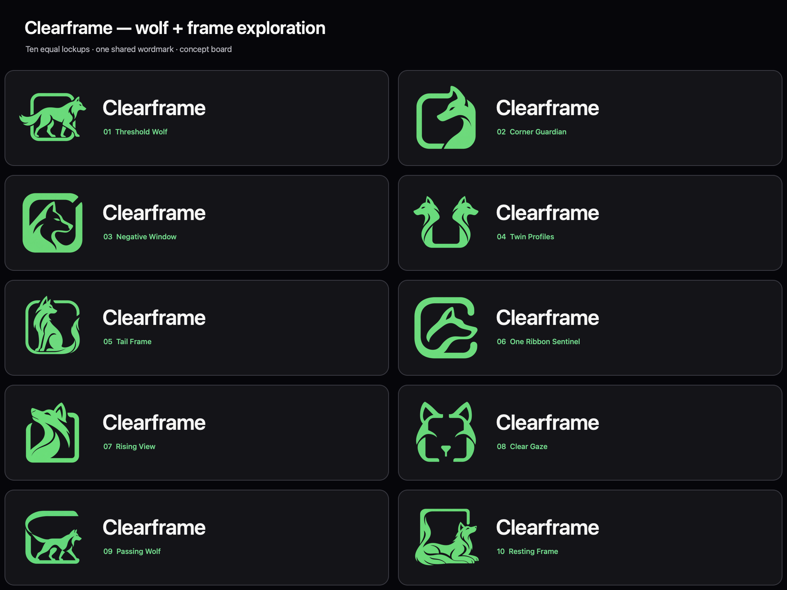

# Clearframe wolf + frame lockups

> These sheets were made on August 31, 2026, while the product was still
> called **Clearframe**. It was renamed **Limeghost** the same day —
> [why](../naming-decision-2026-08-31.md). The wordmarks below are therefore
> the old name; the symbols are what mattered here.

**Date:** August 31, 2026  
**Status:** Concept exploration; not production vector artwork or trademark clearance

This board combines ten distinct wolf-and-frame symbols with one exact,
consistently typeset `Clearframe` wordmark. The symbols were generated as
separate transparent raster concepts with the built-in image-generation
workflow. `make-board.swift` assembles them into the comparison sheet using
native AppKit typography and layout.

## Concepts

1. Threshold Wolf — a full-body wolf passes through the frame.
2. Corner Guardian — a wolf profile and the frame share one corner.
3. Negative Window — a wolf profile is cut from a heavy frame.
4. Twin Profiles — two outward-facing wolves preserve a clear center.
5. Tail Frame — a seated wolf and its tail complete the frame.
6. One Ribbon Sentinel — one continuous-feeling frame resolves into a profile.
7. Rising View — an upward-looking profile grows from the frame.
8. Clear Gaze — a frontal wolf face is reduced to frame-like geometry.
9. Passing Wolf — a trotting wolf defines the lower frame edge.
10. Resting Frame — a reclining wolf wraps around the open center.

## Shared generation brief

- Calm intelligence, clarity, guidance, and ordinary-user friendliness.
- Wolf and frame form one unified symbol rather than separate decorations.
- Compact, vector-friendly geometry intended for 24–64 pixel use.
- Solid Clearframe mint `#66DB7D` on a genuinely transparent background.
- No aggressive expression, fangs, esports styling, shields, moons,
  mountains, forests, crowns, glowing eyes, or generic heraldic badges.
- No text in generated symbols; the board renderer adds the exact wordmark.

The promising directions should be redrawn as deterministic vector paths,
optically corrected at every shipped size, checked against existing marks,
and tested with ordinary users before replacing the current app icon.
